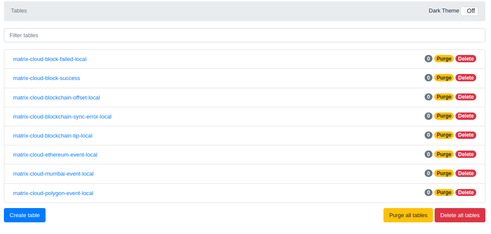
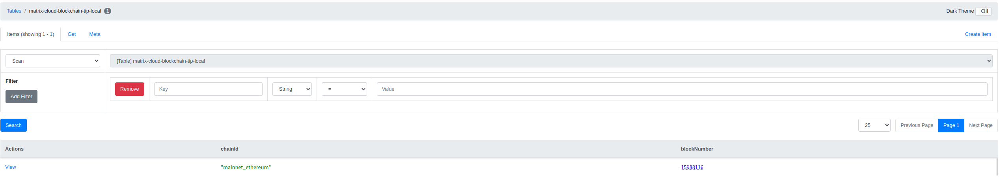
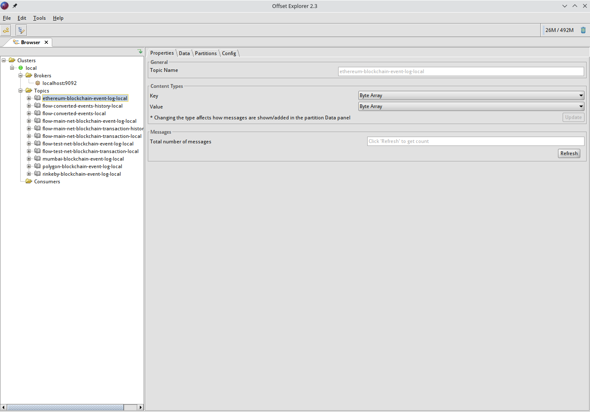

# matrix-cloud-ETL

java环境为jdk11

gradle版本使用每个文件夹内的gradle/gradle-wrapper.properties

## run locally

通过docker和docker-compose安装必要本地环境

docker-compose仓库：https://github.com/WhiteMatrixTech/dev-in-docker

### 安装dynamodb-local

```
cd dynamodb
docker-compose up -d
```

(optional) 验证dynamodb-local是否安装成功

```
npm install -g dynamodb-admin

// For Windows
set DYNAMO_ENDPOINT=http://localhost:8000
dynamodb-admin

// For Mac/Linux
DYNAMO_ENDPOINT=http://localhost:8000 dynamodb-admin
```

安装成功后浏览器打开http://localhost:8001


如果启动SyncerApplication后可以看到如下表的信息



打开表matrix-cloud-blockchain-tip-local，添加如下对象

{
"chainId": "mainnet_ethereum",
"blockNumber": 15988116
}



### 安装kafka-local

```
cd kafka

//按readme中修改参数

docker-compose up -d
```

(optional) 验证kafka-local是否安装成功

根据平台下载并安装kafkatool：https://www.kafkatool.com/download.html

连接配置


启动SyncerApplication后可以看到如下topic的信息



### 安装s3-local

```
cd s3
docker-compose up -d
```

(optional) 验证s3-local是否安装成功

### 安装redis-local

```
cd redis
docker-compose up -d
```

### 申请 ethereum network endpoint

可以去https://www.alchemy.com/ 或者 https://www.infura.io/ 创建app并获取endpoint然后填入
matrix-cloud-blockchain-syncer 中application-local下的blockchain:ethereum-provider-endpoint

## 启动Syncer服务

如果本地环境中没有aws相关配置，在环境变量中设置AWS_ACCESS_KEY_ID=123;AWS_SECRET_KEY=123以跳过aws检查

使用IDEA打开matrix-cloud-blockchain-syncer文件夹，启动matrix-cloud-blockchain-syncer下的SyncerApplication服务
