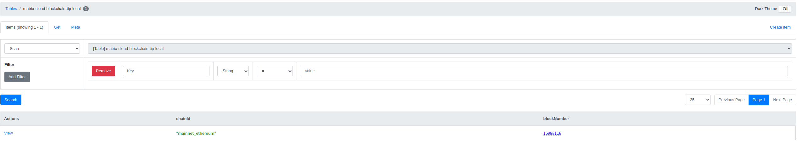
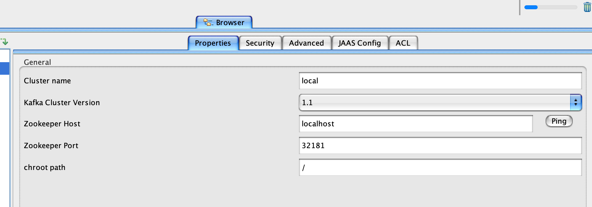
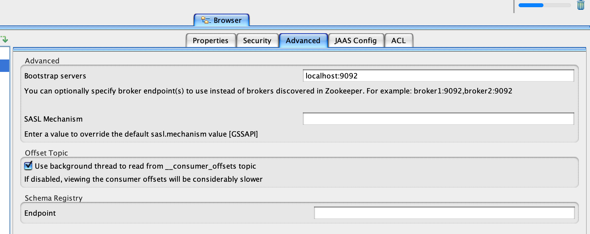
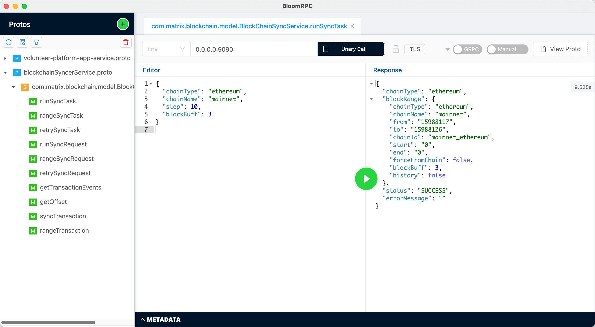

# chainsync-backend

## Prerequisites

- JDK 11
- Docker
- The Gradle version uses gradle/gradle-wrapper.properties inside each folder

## Frontend repository

https://github.com/WhiteMatrixTech/chain-sync-front

## Run locally

1. Start dependent components

```
docker-compose up -d
```

- (optional) Verify that dynamodb-local is installed successfully

```
npm install -g dynamodb-admin

// For Windows
set DYNAMO_ENDPOINT=http://localhost:8000
dynamodb-admin

// For Mac/Linux
DYNAMO_ENDPOINT=http://localhost:8000 dynamodb-admin
```

After the installation is successful, the browser opens http://localhost:8001

If you start SyncerApplication, you can see the information in the following table




- (optional) Verify that Kafka-local is installed successfully

Download and install Kafka tool according to the platform：https://www.kafkatool.com/download.html

Connection configuration





After starting SyncerApplication, you can see the following topic information


2. Apply for Ethereum network endpoint

You can go to https://www.alchemy.com/ or https://www.infura.io/ to create an app and get the endpoint and fill it in
blockchain:ethereum-provider-endpoint under application-local in chainsync-blockchain-syncer

3. Initialize the database

Open the table `chainsync-blockchain-tip-local` and add the following pair

``` json
{
    "chainId": "mainnet_ethereum",
    "blockNumber": 15988116
}
{
    "chainId": "mainnet_bsc",
    "blockNumber": 23525262
}
{
    "chainId": "mainnet_polygon",
    "blockNumber": 36285528
}
```

Open the table `chainsync-task-def-local` and add the following objects

```json
{
 "taskName": "sync_blockchain_ethereum_mainnet",
 "createTime": 1653093501391,
 "delete": false,
 "expression": "5000",
 "latestModifyTime": 1653093501398,
 "params": "{\"chainType\": \"ethereum\", \"chainName\": \"mainnet\", \"step\": 10}",
 "repeated_mode": "fixed_delay",
 "sync": true,
 "taskType": "sync_blockchain"
}
```

4. Start the Syncer service

If there is no aws-related configuration in the local environment, set AWS_ACCESS_KEY_ID=123; AWS_SECRET_KEY=123 in the environment variable to skip the aws check

Use IDEA to open the chainsync-blockchain-syncer folder and start the SyncerApplication service under chainsync-blockchain-syncer

## Retrieve data

1. Call `0.0.0.0:9090` runSyncTask using an RPC client such as [BloomRPC](https://github.com/bloomrpc/bloomrpc).

Request:
``` json
{
    "chainType": "ethereum", 
    "chainName": "mainnet", 
    "step": 10,
    "blockBuff": 3
}
```
Receiving the following response indicates that the synchronization is successful

Response:
``` json
{
  "chainType": "ethereum",
  "blockRange": {
    "chainType": "ethereum",
    "chainName": "mainnet",
    "from": "15988117",
    "to": "15988126",
    "chainId": "mainnet_ethereum",
    "start": "0",
    "end": "0",
    "forceFromChain": false,
    "blockBuff": 3,
    "history": false
  },
  "status": "SUCCESS",
  "errorMessage": ""
}
```



At this time, open the `chainsync-eth-transaction-local` table to see the synchronized block and transaction information.

2. (optional) Start the downstream service `chainsync-blockchain-event-handler-service`

Start the downstream service `chainsync-blockchain-event-handler-service` and repeat step 1. At this time, open the chainsync-token-local table to see the token data parsed by the downstream handler.

3. After confirming that step 2 is successful, start the TaskApplication service under `chainsync-schedule-task` to automatically synchronize blocks at regular intervals