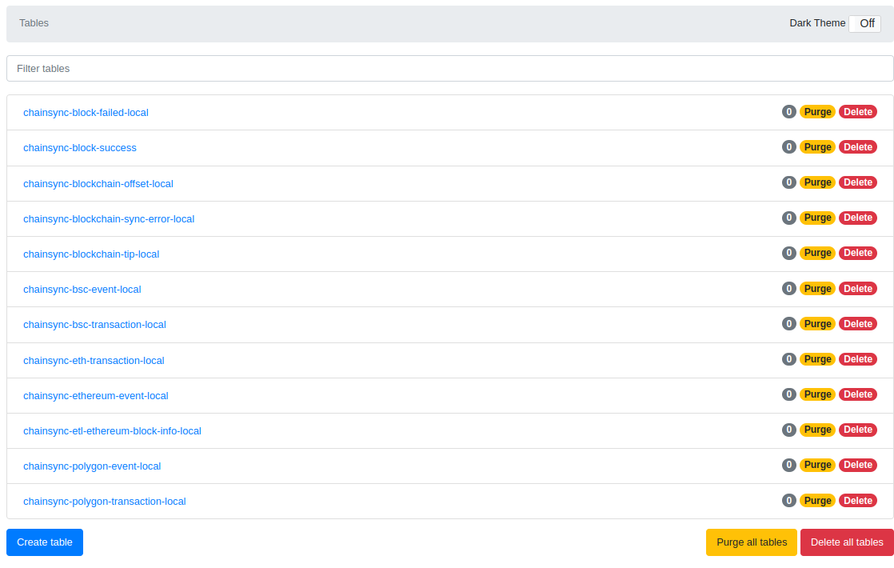
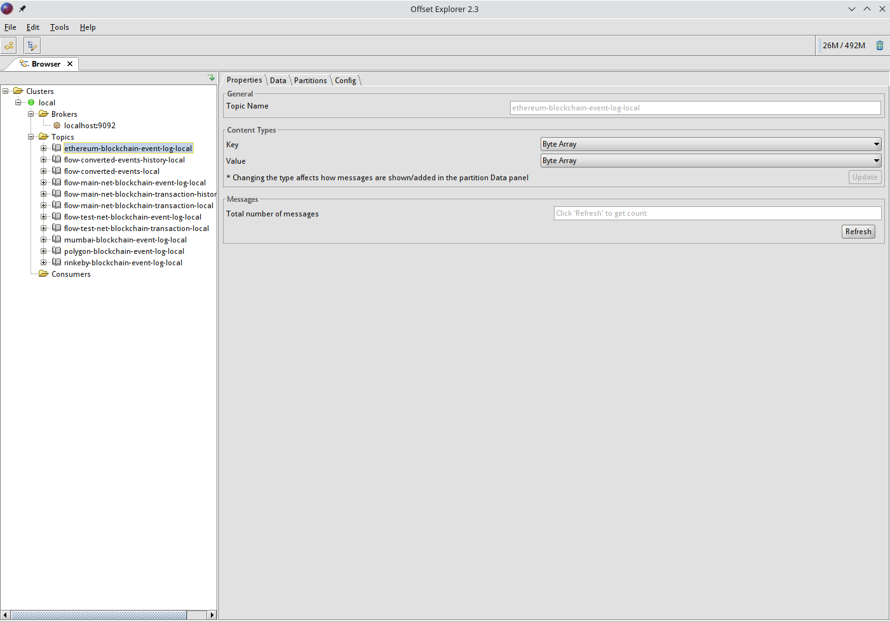

# chainsync

- JDK 11
- Docker
- The Gradle version uses gradle/gradle-wrapper.properties inside each folder

## Frontend repository

https://github.com/WhiteMatrixTech/matrix-cloud-ETL-front-public

## Run locally

1. create the necessary local environment through docker and docker-compose

```
docker-compose up -d
```

- Verify that dynamodb-local is installed successfully (optional)

```
npm install -g dynamodb-admin

// For Windows
set DYNAMO_ENDPOINT=http://localhost:8000
dynamodb-admin

// For Mac/Linux
DYNAMO_ENDPOINT=http://localhost:8000 dynamodb-admin
```

After the installation is successful, the browser opens http://localhost:8001

If you start SyncerApplication, you can see the information in the following table



Open the table chainsync-blockchain-tip-local and add the following objects:

``` json
{
    "chainId": "mainnet_ethereum",
    "blockNumber": 15988116
}
{
    "chainId": "mainnet_bsc",
    "blockNumber": 23525262
}
{
    "chainId": "mainnet_polygon",
    "blockNumber": 36285528
}
```

Open the table chainsync-task-def-local and add the following objects:

```json
{
 "taskName": "sync_blockchain_ethereum_mainnet",
 "createTime": 1653093501391,
 "delete": false,
 "expression": "5000",
 "latestModifyTime": 1653093501398,
 "params": "{\"chainType\": \"ethereum\", \"chainName\": \"mainnet\", \"step\": 10}",
 "repeated_mode": "fixed_delay",
 "sync": true,
 "taskType": "sync_blockchain"
}
```


- Verify that kafka-local is installed successfully (optional)

Download and install kafka tool according to the platform：https://www.kafkatool.com/download.html

Connection configuration


After starting SyncerApplication, you can see the following information



2. Apply for Ethereum network endpoint

Visit https://www.alchemy.com/ or https://www.infura.io/ to create an app and get the endpoint and
fill it in blockchain:ethereum-provider-endpoint under application-local in
chainsync-blockchain-syncer.

3. Start the Syncer service

If there is no AWS-related configuration in the local environment, set AWS_ACCESS_KEY_ID=123;
AWS_SECRET_KEY=123 in the environment variable to skip the AWS check.

Use IDEA to open the chainsync-blockchain-syncer folder and start the SyncerApplication service
under chainsync-blockchain-syncer.
