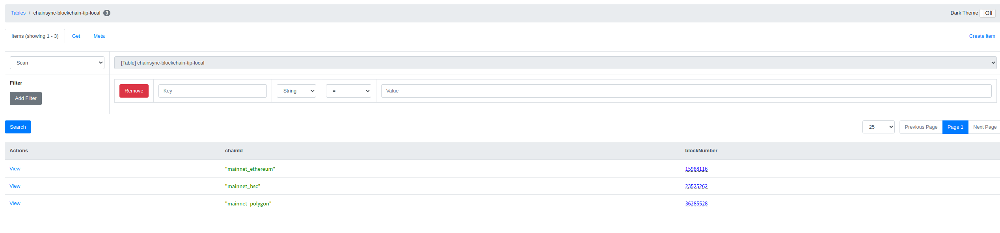

# chainsync-backend

## Prerequisites

- JDK 11
- Docker
- Gradle版本使用每个文件夹内的gradle/gradle-wrapper.properties

## Frontend repository

https://github.com/WhiteMatrixTech/chain-sync-front

## Run locally

1. 启动依赖的组件

```
docker-compose up -d
```

- (optional) 验证dynamodb-local是否安装成功

```
npm install -g dynamodb-admin

// For Windows
set DYNAMO_ENDPOINT=http://localhost:8000
dynamodb-admin

// For Mac/Linux
DYNAMO_ENDPOINT=http://localhost:8000 dynamodb-admin
```

安装成功后浏览器打开http://localhost:8001

如果启动SyncerApplication后可以看到如下表的信息




- (optional) 验证kafka-local是否安装成功

根据平台下载并安装kafkatool：https://www.kafkatool.com/download.html

连接配置


启动SyncerApplication后可以看到如下topic的信息


2. 申请 ethereum network endpoint

可以去https://www.alchemy.com/ 或者 https://www.infura.io/ 创建app并获取endpoint然后填入
chainsync-blockchain-syncer 中application-local下的blockchain:ethereum-provider-endpoint

3. 初始化数据库

打开表 `chainsync-blockchain-tip-local`，添加如下对象

``` json
{
    "chainId": "mainnet_ethereum",
    "blockNumber": 15988116
}
{
    "chainId": "mainnet_bsc",
    "blockNumber": 23525262
}
{
    "chainId": "mainnet_polygon",
    "blockNumber": 36285528
}
```

打开表 `chainsync-task-def-local`，添加如下对象

```json
{
 "taskName": "sync_blockchain_ethereum_mainnet",
 "createTime": 1653093501391,
 "delete": false,
 "expression": "5000",
 "latestModifyTime": 1653093501398,
 "params": "{\"chainType\": \"ethereum\", \"chainName\": \"mainnet\", \"step\": 10}",
 "repeated_mode": "fixed_delay",
 "sync": true,
 "taskType": "sync_blockchain"
}
```

4. 启动Syncer服务

如果本地环境中没有aws相关配置，在环境变量中设置AWS_ACCESS_KEY_ID=123;AWS_SECRET_KEY=123以跳过aws检查

使用IDEA打开chainsync-blockchain-syncer文件夹，启动chainsync-blockchain-syncer下的SyncerApplication服务

## Retrieve data

1. 使用 RPC 客户端（例如：[BloomRPC](https://github.com/bloomrpc/bloomrpc) 调用 `0.0.0.0:9090` runSyncTask。

Request:
``` json
{
    "chainType": "ethereum", 
    "chainName": "mainnet", 
    "step": 10,
    "blockBuff": 3
}
```
收到以下响应表示同步成功

Response:
``` json
{
  "chainType": "ethereum",
  "blockRange": {
    "chainType": "ethereum",
    "chainName": "mainnet",
    "from": "15988117",
    "to": "15988126",
    "chainId": "mainnet_ethereum",
    "start": "0",
    "end": "0",
    "forceFromChain": false,
    "blockBuff": 3,
    "history": false
  },
  "status": "SUCCESS",
  "errorMessage": ""
}
```


此时打开 `chainsync-eth-transaction-local` 表可以看到同步到的区块和交易信息。

2. (optional) 启动下游服务 `chainsync-blockchain-event-handler-service`

启动下游服务 `chainsync-blockchain-event-handler-service` 后重复步骤1，此时打开 chainsync-token-local 表可以看到下游handler解析出的token数据。

3. 确定2成功后，启动 `chainsync-schedule-task` 下的TaskApplication服务即可自动定时同步区块